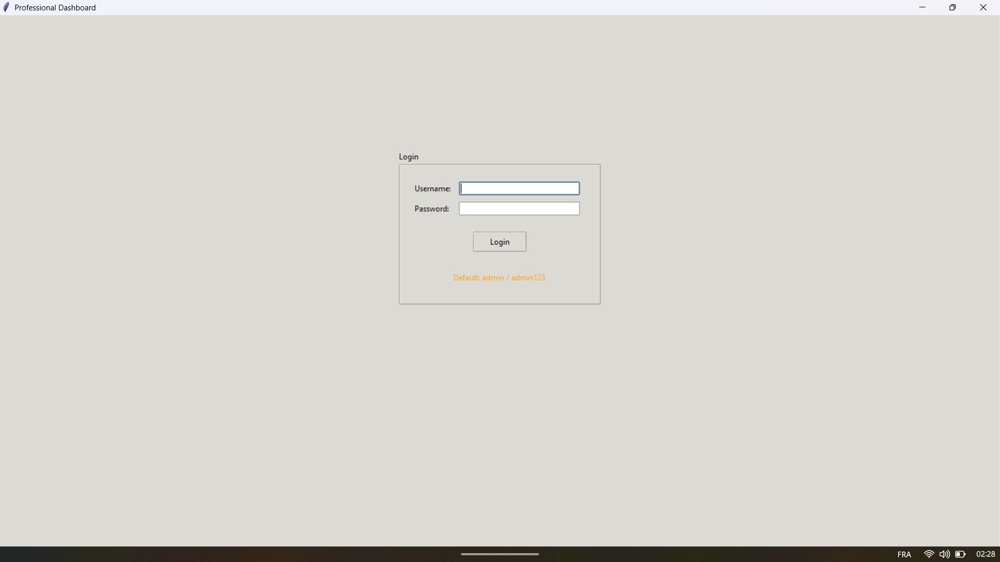

# Building Professional Dashboards with Python and Tkinter

[](https://www.python.org/downloads/)
[](https://docs.python.org/3/library/tkinter.html)
[](LICENSE)
[](https://github.com/michaelgermini/Building-Professional-Dashboards-with-Python-and-Tkinter)

> **A comprehensive, production-ready guide for building enterprise-grade dashboards with Python and Tkinter**

This repository contains a complete educational resource for creating professional, scalable dashboard applications using Python's built-in GUI framework. From basic widgets to advanced data visualization, this guide covers everything needed to build production-ready dashboard applications.

## 🎯 What You'll Learn

- **Modern GUI Development** with Tkinter and ttkbootstrap
- **Data Visualization** using Matplotlib and interactive charts
- **Database Integration** with SQLite and advanced CRUD operations
- **Real-time Applications** with threading and event-driven programming
- **Professional Architecture** using MVC patterns and modular design
- **Production Deployment** with packaging and distribution tools
- **Enterprise Features** including authentication, reporting, and analytics

## 📚 Complete Learning Path

### 🚀 Progressive Curriculum (10 Chapters)

| Chapter | Focus | Skills Developed |
|---------|-------|------------------|
| **1** | Getting Started | Basic Tkinter concepts, window management |
| **2** | Core Widgets | Form creation, layout management |
| **3** | Events & Callbacks | Interactive applications, real-time updates |
| **4** | Dashboard Architecture | MVC patterns, custom widgets |
| **5** | Data Visualization | Matplotlib integration, charts and graphs |
| **6** | Advanced Widgets | Treeview, Notebook, professional interfaces |
| **7** | Database Integration | SQLite, CRUD operations, data persistence |
| **8** | Real-time Dashboards | Threading, monitoring, live data |
| **9** | Exporting & Reporting | PDF generation, data export |
| **10** | Complete Professional Dashboard | Full-stack application development |

### 🏆 Final Project

The comprehensive final project demonstrates a production-ready dashboard with:

- **🔐 User Authentication & Authorization**
- **📊 Advanced Data Analytics**
- **🔄 Real-time Data Updates**
- **📈 Interactive Visualizations**
- **💾 Database Management**
- **📋 Report Generation**
- **🎨 Customizable Themes**
- **📱 Responsive Design**

## 📸 Application Screenshots

### 🔐 Login Interface

*Secure authentication with role-based access control*

### 📊 Main Dashboard

*Real-time metrics and key performance indicators*

### 💾 Data Management

*Comprehensive database operations and data visualization*

### 📋 Reports & Analytics

*Advanced reporting and analytics capabilities*

### ⚙️ Settings & Configuration

*Customizable themes and application configuration*

### 🎨 Visual Features

The professional dashboard includes:

- **🔐 Secure Login System** - Role-based authentication with user management
- **📊 Real-time Dashboard** - Live metrics and performance indicators
- **📈 Interactive Charts** - Dynamic data visualization with Matplotlib
- **💾 Database Integration** - SQLite database with CRUD operations
- **📋 Report Generation** - PDF and Excel export capabilities
- **⚙️ Theme Customization** - Multiple color schemes and layouts
- **📱 Responsive Design** - Adapts to different screen sizes
- **🔄 Real-time Updates** - Live data monitoring and alerts

## 🛠️ Technology Stack

### Core Technologies
- **Python 3.8+** - Primary programming language
- **Tkinter** - Native GUI framework
- **ttkbootstrap** - Modern theming and styling

### Data & Visualization
- **Matplotlib** - Professional charting and plotting
- **Pandas** - Data manipulation and analysis
- **NumPy** - Numerical computing

### Database & Storage
- **SQLite** - Lightweight database engine
- **JSON** - Configuration and data exchange

### Reporting & Export
- **ReportLab** - PDF report generation
- **openpyxl** - Excel file handling
- **CSV** - Data export functionality

### System & Monitoring
- **psutil** - System resource monitoring
- **threading** - Concurrent operations
- **schedule** - Automated task scheduling

## 🚀 Quick Start

### Prerequisites

```bash
# Ensure Python 3.8+ is installed
python --version

# Verify pip is available
pip --version
```

### Installation

1. **Clone the repository**
   ```bash
   git clone https://github.com/michaelgermini/Building-Professional-Dashboards-with-Python-and-Tkinter.git
   cd Building-Professional-Dashboards-with-Python-and-Tkinter
   ```

2. **Create virtual environment (recommended)**
   ```bash
   python -m venv venv
   
   # On Windows
   venv\Scripts\activate
   
   # On macOS/Linux
   source venv/bin/activate
   ```

3. **Install dependencies**
   ```bash
   pip install -r requirements.txt
   ```

4. **Launch the professional dashboard**
   ```bash
   # Option 1: Chapter 10 complete dashboard
   cd chapters/chapter10-complete-professional-dashboard
   python main.py
   
   # Option 2: Final project
   cd final-project
   python main.py
   ```

### 🔑 Default Credentials

| Role | Username | Password |
|------|----------|----------|
| **Administrator** | `admin` | `admin123` |
| **Manager** | `manager` | `manager123` |
| **User** | `user` | `user123` |

## 📁 Project Structure

```
Building-Professional-Dashboards-with-Python-and-Tkinter/
├── 📄 README.md                           # Project documentation
├── 📋 requirements.txt                    # Python dependencies
├── 📖 TABLE_OF_CONTENTS.md               # Detailed book structure
├── 📝 preface.md                         # Book introduction
├── 📚 chapters/                          # Educational content
│   ├── 📖 chapter01-getting-started/     # Tkinter fundamentals
│   ├── 🧩 chapter02-core-widgets/        # Essential widgets
│   ├── ⚡ chapter03-events-callbacks/    # Interactive applications
│   ├── 🏗️ chapter04-dashboard-architecture/ # Design patterns
│   ├── 📊 chapter05-data-visualization/  # Charts and graphs
│   ├── 🔧 chapter06-advanced-widgets/    # Professional components
│   ├── 💾 chapter07-database-integration/ # Data persistence
│   ├── ⏱️ chapter08-real-time-dashboards/ # Live applications
│   ├── 📤 chapter09-exporting-reporting/ # Export functionality
│   └── 🏆 chapter10-complete-professional-dashboard/ # Full application
├── 🎯 final-project/                     # Production-ready demo
├── 📚 appendices/                        # Comprehensive reference materials
│   ├── 📖 appendix_a_tkinter_widget_reference.md
│   ├── 📦 appendix_b_python_packaging.md
│   └── 🚀 appendix_c_deployment_guide.md
├── 🧪 exercises_summary.md               # Complete exercise collection
├── 🔧 additional_exercises.md            # Advanced practice exercises
├── 💡 exercise_solutions.md              # Complete exercise solutions
├── 📈 learning_progression_guide.md      # Structured learning roadmap
├── 📸 app_pict/                          # Application screenshots
│   ├── 🔐 Login.png                      # Login interface
│   ├── 📊 Dashboard.png                  # Main dashboard
│   ├── 💾 Data_Management.png           # Data management
│   ├── 📋 Reports.png                    # Reports interface
│   └── ⚙️ Settings.png                   # Settings panel
└── ⚙️ .github/                           # CI/CD and automation
    ├── 📋 workflows/                     # GitHub Actions
    ├── 🏷️ ISSUE_TEMPLATE/               # Issue templates
    └── 📝 pull_request_template.md       # PR template
```

## 🎓 Learning Methodology

### 📖 Progressive Learning Approach

1. **Foundation First** - Master basic Tkinter concepts
2. **Hands-on Practice** - Complete all exercises and examples
3. **Real-world Projects** - Build practical applications
4. **Advanced Concepts** - Learn enterprise patterns
5. **Production Ready** - Deploy professional applications

### 🎯 Skill Development Path

| Level | Focus | Duration | Outcome |
|-------|-------|----------|---------|
| **Beginner** | Basic widgets, layouts | 2-3 weeks | Simple applications |
| **Intermediate** | Events, data visualization | 3-4 weeks | Interactive dashboards |
| **Advanced** | Database, real-time | 2-3 weeks | Data-driven applications |
| **Expert** | Architecture, deployment | 2-3 weeks | Production systems |

## 📚 Appendices & Reference Materials

### 🔍 Comprehensive Reference Guides

The appendices provide essential reference materials for professional development:

#### 📖 Appendix A: Tkinter Widget Reference
- **Complete Widget Catalog** - All Tkinter widgets with examples
- **Widget Properties** - Detailed property documentation
- **Layout Managers** - Pack, Grid, and Place usage guides
- **Styling Options** - Colors, fonts, and themes
- **Best Practices** - Widget selection and usage guidelines

#### 📦 Appendix B: Python Packaging & Distribution
- **Application Packaging** - PyInstaller and cx_Freeze guides
- **Executable Creation** - Cross-platform distribution
- **Installation Scripts** - Windows, macOS, and Linux
- **Dependency Management** - Virtual environments and requirements
- **Deployment Strategies** - Production deployment options

#### 🚀 Appendix C: Deployment & Production Guide
- **Server Deployment** - Web server integration
- **Containerization** - Docker and container strategies
- **Cloud Deployment** - AWS, Azure, and GCP options
- **Performance Optimization** - Application tuning
- **Monitoring & Logging** - Production monitoring setup

### 🎯 How to Use Appendices

1. **Quick Reference** - Use as lookup guides during development
2. **Troubleshooting** - Find solutions to common issues
3. **Best Practices** - Learn industry-standard approaches
4. **Advanced Topics** - Explore production-ready techniques
5. **Deployment** - Guide for application distribution

## 🧪 Exercises & Practice Materials

### 📚 Comprehensive Exercise Collection

This project includes extensive practice materials to reinforce learning:

#### 🎯 Exercise Summary
- **Complete Exercise Collection** - Overview of all exercises across 10 chapters
- **Progressive Difficulty** - From beginner to expert level
- **Skill Assessment** - Track your progress and mastery
- **Learning Path** - Structured progression through concepts

#### 🔧 Additional Exercises
- **Advanced UI Components** - Custom widgets and complex interfaces
- **Data Visualization Extensions** - Advanced charting and 3D visualization
- **Real-time Applications** - WebSocket, IoT, and social media dashboards
- **Enterprise Features** - Multi-user systems and API integration
- **Performance Optimization** - High-performance data grids and caching
- **Advanced Features** - Plugin systems and configuration management

#### 💡 Complete Solutions
- **Step-by-step Solutions** - Detailed explanations for all exercises
- **Best Practices** - Professional coding standards and patterns
- **Code Quality** - Production-ready implementations
- **Design Patterns** - MVC, Observer, and other architectural patterns

#### 📈 Learning Progression Guide
- **10-Week Learning Plan** - Structured daily and weekly schedules
- **Project Portfolio** - Build real-world applications
- **Skill Assessment** - Track your development progress
- **Success Tips** - Expert advice for effective learning

### 🎓 Exercise Features

- **Hands-on Practice** - Real coding exercises with immediate feedback
- **Progressive Complexity** - Build skills gradually from basic to advanced
- **Real-world Projects** - Practical applications you can use
- **Complete Solutions** - Learn from professional implementations
- **Best Practices** - Industry-standard coding patterns

## 🔧 Development Features

### 🛠️ Built-in Tools
- **Code Examples** - Fully functional, tested code
- **Exercise Solutions** - Complete implementations
- **Best Practices** - Industry-standard patterns
- **Error Handling** - Robust exception management
- **Documentation** - Comprehensive guides

### 🚀 Production Features
- **Modular Architecture** - Scalable design patterns
- **Database Integration** - SQLite with ORM patterns
- **Real-time Updates** - Threading and scheduling
- **Export Capabilities** - PDF, Excel, CSV formats
- **User Management** - Authentication and authorization
- **Theming System** - Customizable appearance
- **Logging** - Comprehensive error tracking

## 🤝 Contributing

We welcome contributions from the community! Here's how you can help:

### 🐛 Bug Reports
- Use the [bug report template](.github/ISSUE_TEMPLATE/bug_report.md)
- Include detailed reproduction steps
- Provide system information and error logs

### 💡 Feature Requests
- Use the [feature request template](.github/ISSUE_TEMPLATE/feature_request.md)
- Describe the use case and benefits
- Suggest implementation approach

### 📝 Code Contributions
1. Fork the repository
2. Create a feature branch
3. Make your changes
4. Add tests if applicable
5. Submit a pull request

### 📚 Documentation
- Improve existing documentation
- Add code comments and examples
- Create tutorials and guides

## 📄 License

This project is licensed under the MIT License - see the [LICENSE](LICENSE) file for details.

## 🆘 Support & Community

### 📖 Documentation
- **Chapter Guides** - Detailed explanations in each chapter
- **Code Examples** - Fully functional demonstration code
- **Exercise Solutions** - Complete implementations
- **Best Practices** - Industry-standard recommendations

### 🐛 Troubleshooting
1. **Check Documentation** - Review chapter content and examples
2. **Verify Dependencies** - Ensure all packages are installed
3. **Test Examples** - Run provided code samples
4. **Search Issues** - Look for similar problems in GitHub issues
5. **Create Issue** - Use templates for bug reports or questions

### 📞 Contact
- **Email**: michael@germini.info
- **GitHub Issues**: [Create an issue](https://github.com/michaelgermini/Building-Professional-Dashboards-with-Python-and-Tkinter/issues)
- **Discussions**: [GitHub Discussions](https://github.com/michaelgermini/Building-Professional-Dashboards-with-Python-and-Tkinter/discussions)

## 🌟 Star History

[](https://star-history.com/#michaelgermini/Building-Professional-Dashboards-with-Python-and-Tkinter&Date)

## 📊 Project Statistics


---

<div align="center">

**Ready to build professional dashboards? Start your journey today! 🚀**

[](chapters/chapter01-getting-started/)

## 📚 Chapter READMEs

### 🎯 Quick Navigation to All Chapters

| Chapter | Title | README Link | Focus |
|---------|-------|-------------|-------|
| **1** | Getting Started | [📖 README](chapters/chapter01-getting-started/README.md) | Basic Tkinter concepts |
| **2** | Core Widgets | [📖 README](chapters/chapter02-core-widgets/README.md) | Essential widgets |
| **3** | Events & Callbacks | [📖 README](chapters/chapter03-events-callbacks/README.md) | Interactive applications |
| **4** | Dashboard Architecture | [📖 README](chapters/chapter04-dashboard-architecture/README.md) | MVC patterns |
| **5** | Data Visualization | [📖 README](chapters/chapter05-data-visualization/README.md) | Charts and graphs |
| **6** | Advanced Widgets | [📖 README](chapters/chapter06-advanced-widgets/README.md) | Professional components |
| **7** | Database Integration | [📖 README](chapters/chapter07-database-integration/README.md) | SQLite operations |
| **8** | Real-time Dashboards | [📖 README](chapters/chapter08-real-time-dashboards/README.md) | Live applications |
| **9** | Exporting & Reporting | [📖 README](chapters/chapter09-exporting-reporting/README.md) | PDF generation |
| **10** | Complete Professional Dashboard | [📖 README](chapters/chapter10-complete-professional-dashboard/README.md) | Full application |

### 🚀 Direct Links to Key Resources

- **📖 Main Documentation**: [README.md](README.md)
- **🎯 Start Learning**: [Chapter 1 README](chapters/chapter01-getting-started/README.md)
- **🏆 View Demo**: [Chapter 10 README](chapters/chapter10-complete-professional-dashboard/README.md)
- **🧪 Exercise Collection**: [exercises_summary.md](exercises_summary.md)
- **💡 Complete Solutions**: [exercise_solutions.md](exercise_solutions.md)
- **📈 Learning Progression**: [learning_progression_guide.md](learning_progression_guide.md)
- **🔧 Advanced Exercises**: [additional_exercises.md](additional_exercises.md)

### 📖 Reference Materials

- **📖 Tkinter Widget Reference**: [appendix_a_tkinter_widget_reference.md](appendices/appendix_a_tkinter_widget_reference.md)
- **📦 Python Packaging Guide**: [appendix_b_python_packaging.md](appendices/appendix_b_python_packaging.md)
- **🚀 Deployment Guide**: [appendix_c_deployment_guide.md](appendices/appendix_c_deployment_guide.md)

### 🌐 Additional Resources

- **🌐 Interactive Website**: [index.html](index.html) - Modern web interface for navigation
- **📄 Website Documentation**: [website-README.md](website-README.md) - Website features and usage
- **📋 Table of Contents**: [TABLE_OF_CONTENTS.md](TABLE_OF_CONTENTS.md) - Detailed book structure
- **📝 Preface**: [preface.md](preface.md) - Book introduction and overview

### 📖 Book Structure

- **📝 [Preface](preface.md)** - Introduction and book overview
- **📋 [Table of Contents](TABLE_OF_CONTENTS.md)** - Detailed book structure
- **📚 [Chapter 1: Getting Started](chapters/chapter01-getting-started/README.md)** - Basic Tkinter concepts
- **🏆 [Chapter 10: Complete Professional Dashboard](chapters/chapter10-complete-professional-dashboard/README.md)** - Complete application

*Built with ❤️ for the Python community*

</div>
